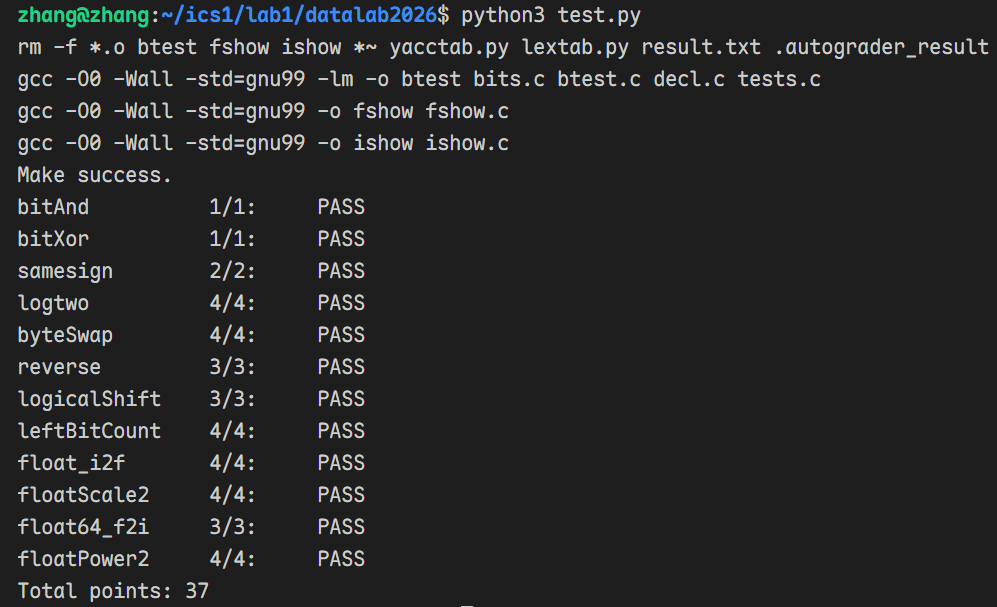

# datalab 报告

姓名：张一豪

学号：2025202004

| 总分 | bitAnd | bitXor | samesign | logtwo | byteSwap | reverse | logicalShift | leftBitCount | float_i2f | floatScale2 | float64_f2i | floatPower2 |
| ---- | ------ | ------ | -------- | ------ | -------- | ------- | ------------ | ------------ | --------- | ----------- | ----------- | ----------- |
| 37.00 | 1.00 | 1.00 | 2.00 | 4.00 | 4.00 | 3.00 | 3.00 | 4.00 | 4.00 | 4.00 | 3.00 | 4.00 |


test 截图：



## 解题报告

### 亮点

1. leftBitCount
2. floatScale2

### bitAnd

```c
~(~x | ~y);
```

使用德摩根律，
$$
x \& y = \sim(\sim x \mid \sim y)
$$

### bitXor

```c
~(x & y) & ~(~x & ~y);
```

使用异或的等价形式和德摩根律

$$
A \oplus B=
\neg(A\land B)\land\neg(\neg A\land\neg B)
$$


### samesign
先单独处理 0。题目规定 0 既不是正数也不是负数，因此只有 `x == 0 && y == 0` 时返回 1。

对于两个非零整数，取最高位判断符号，并通过异或判断符号是否相同：

```c
if (!x) return !y;
if (!y) return 0;
return !((x >> 31) ^ (y >> 31));
```


### logtwo


查找最高位的1所在的位置，使用二分查找：先对`v`和`0xFFFF`比大小，如果`v`>`0xFFFF`，则最高位的1在高16位，对`v`进行右移16位的操作，并且`result |= shift`，反之则跳过右移和改变`result`的操作。
```c
shift = (v > 0xFFFF) << 4;
v = v >> shift;
result |= shift;
```
后续依次判断 `0xFF`、`0xF`、`0x3` 和 `0x1`。由于每次得到的 `shift` 分别只可能是 `16、8、4、2、1` 或 0，因此可以直接使用 `|` 累积最终结果。

### byteSwap
第 `n` 个字节对应的位移量为：
```c
n << 3
```

先提取两个需要交换的字节：
```c
nb = (x >> ns) & 0xFF;
mb = (x >> ms) & 0xFF;
```

然后构造 mask，将原位置清零：
```c
mask = ~((0xFF << ns) | (0xFF << ms));
```

最后把两个字节交换位置后重新放回：
```c
return (x & mask) | (nb << ms) | (mb << ns);
```

### reverse

由于题目不能使用 `<` 等比较运算，使用：
```c
counter = 0xFFFFFFFF;
```
作为循环计数器，每次右移一位，经过 32 次后变为 0。
每轮循环先将 `result` 左移一位，再取出 `v` 的最低位放入结果：
```c
result <<= 1;
result |= v & 1;
v >>= 1;
```

### logicalShift
实现 `int`型整数的逻辑右移。构造掩码 `mask` 
```c
int i = 0x80000000;
int mask = (i >> n) << 1;
```
取反后得到高 `n` 位为 0、其余位为 1 的掩码：
```c
return (~mask) & (x>>n);
```

### leftBitCount
首先对 `x` 取反
```c
fx = ~x;
```
将问题转化为寻找 `fx` 的最高有效位 1。

与 `logtwo` 类似，使用二分搜索。但本题禁止使用 `<` 和 `>`，因此使用：
```c
!!(fx >> 16)
```
判断高 16 位是否存在 1。
然后依次处理 8、4、2、1 位。

设最终找到的最高有效位位置为 `result`，答案为 $31-result$ ，但由于题目不能使用减法，因此利用补码实现减法：

$$
31-result = 32+\sim result
$$

但当 `x = -1` 时，没有最高有效位 1，二分搜索得到 `result = 0`，正常公式只会得到 31，而正确答案应为 32，因此使用：
```c
!~x
```
作为特殊补偿项，最终：
```c
return 32 + ~result + !~x;
```


### float_i2f
本题分为三步：
1. 确定 sign
2. 找到最高有效位，确定 exp
3. 根据有效位数决定是否需要舍入

对于负数，转换为绝对值：
```c
sign = ux & 0x80000000;
if (sign)
    ux = ~ux + 1;
```


使用以下循环
```c
while ((ux >> pos) > 1)
    pos += 1;
```
找到最高有效位位置 `pos`。
如果 `pos <= 23` ，说明有效位数不超过 24，可以精确表示，只需要把最高位移动到 23：
```c
frac = ux << (23 - pos);
```
如果 `pos > 23`，则需要丢弃部分低位。设：`shift = pos - 23`

保留最高 24 位：
```c
frac = ux >> shift;
```
并记录被丢弃的部分：
```c
lost = ux & ((1u << shift) - 1u);
half = 1u << (shift - 1);
```

根据浮点数的规则来舍入：
```c
if (lost > half)
    frac += 1;
else if (lost == half && (frac & 1))
    frac += 1;
```

如果舍入导致 `1.111111...` 变成 `10.000000...`，则 exponent 需要额外加 1：
```c
exp = exp + (frac >> 24);
```

最后去掉隐藏位并拼接三个字段：
```c
return sign | (exp << 23) | (frac & 0x7FFFFF);
```

### floatScale2

将浮点数乘2，用截断的方法，分别提取浮点数编码的三个部分 `sign` 、 `exp` 和 `frac`，分类讨论：
+ NaN / 无穷：即 `exp = 0x7F800000` ，按照题目要求，直接返回参数。
+ 非规格化数：即 `exp = 0x0` ，将 `frac` 左移一位即可。
+ 规格化数：通过 
```c
exp += 0x800000
```
   将 `exp` 部分加1，如果 `exp=0x7F800000` ，则得到无穷数，将 `frac` 部分清零。最终返回
```c
return sign | exp | frac;
```

### float64_f2i

先使用右移和截断 `uf2` 的方法，得到 `sign` 、 `exp`和 `fracHigh`，`fracLow`即为`uf1`，`e = exp - 1023` 得到真实指数。
然后分类讨论：
+ `exp == 0x7FF`：NaN 或无穷，返回 `0x80000000`
+ `e < 0`：绝对值小于 1，按照题意，向 0 截断，返回 0
+ `e >= 31`：超出int范围，返回 `0x80000000`
+ `e <= 20`：整数部分完全位于 `隐藏位 1 + fracHigh` 中
```c
result = (1 << e) | (fracHigh >> (20 - e));
```
+ `20 < e < 31`：整数部分需要使用 `fracLow` 的高位：

```c
result = (1 << e) | (fracHigh << (e - 20)) | (fracLow >> (52 - e));
```

最后根据 sign 转为正数或负数：

```c
if (sign)
    return -result;
else
    return result;
```

### floatPower2

求 `2.0^x`，进行分类讨论：
+ `x<-149`： 小于非规格化数，返回0
+ `-149<=x<=-127`：非规格化数，阶码为0，计算尾数位 `frac = 1 << (x + 149)`
+ `-127<x<=127`：规格化数，计算 `exp = x + 127`，再将 exp 左移 23 位
+ `x>127`：超出最大规格化数，返回`0x7F800000`


## 反馈/收获/感悟/总结

第一次写ICS的lab，虽然感觉有点艰难，前前后后写了三天，但感觉确实对 `bit pattern` 和 `IEEE 754` 的理解提升了很多，做完后有点兴奋，以致于还有点失眠（笑）。
感觉之前不懂、不理解的一些现象，现在都有了比较透彻的认识。比如Python的 `0.1 + 0.2 != 0.3`。
希望是我大二学习生活的一个好的开端。

## 参考的重要资料
+ 深入理解计算机系统
+ [【CSAPP-深入理解计算机系统】2-4.浮点数(上)](https://www.bilibili.com/video/BV1VK4y1f7o6?spm_id_from=333.788.videopod.sections&vd_source=ab807c397abbb1a8c00ba455da968923)


